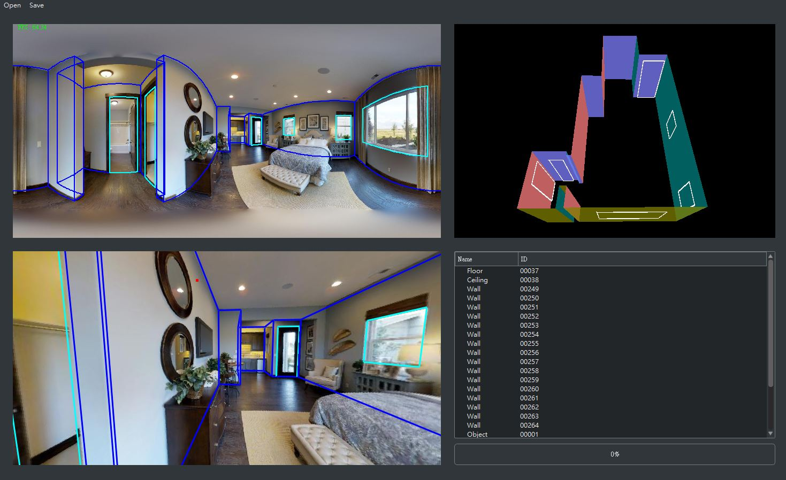
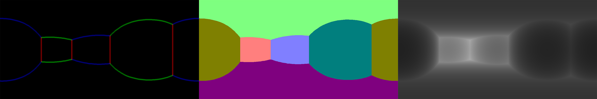

# PanoAnnotator
A semi-automatic tool for indoor panorama layout annotation.



## Prerequisites
- Python >= 3.6
- tensorflow >= 1.10
- PyQt5 / PyOpenGL
- Numpy / Pillow / scikit-image

You can install all dependency by [Anaconda] environment file (detail in Setup section). 

## Setup

**1. Download pre-trained model**

Download our pre-trained depth estimation [model] and copy to ./estimator/depth/models/trained

**2. Setup environment**

You can install the dependencies by yourself. Otherwise, if you already installed Anaconda, you can create and activate the environment by

```
conda env create -f ./scripts/annotator_env.yml
activate Annotator
```

**3. Launch PanoAnnotator**

```
python ./MainWindow.py
```

## Pre-process

Our system inputs are a Manhattan-aligned color panorama, its lines map and orientation map (optional). **In Matlab**, you can generate those images by

```
cd ./preprocess/matlab
preprocess([input file path], [outputs path])
```
the preprocessing code are mostly from [PanoBasic]

## Output maps



To convert the annotation label to feature maps (including edges, orientation map, surface normal and depth), please run the scripts

```
cd ./scripts
python json2maps -i [input json path]
```

[Anaconda]: <https://www.anaconda.com/>
[model]: <https://drive.google.com/file/d/1KdSTLXKNd2s67NRvXLOebB0dqQPzcQ5n/view?usp=sharing>
[PanoBasic]: <https://github.com/yindaz/PanoBasic>